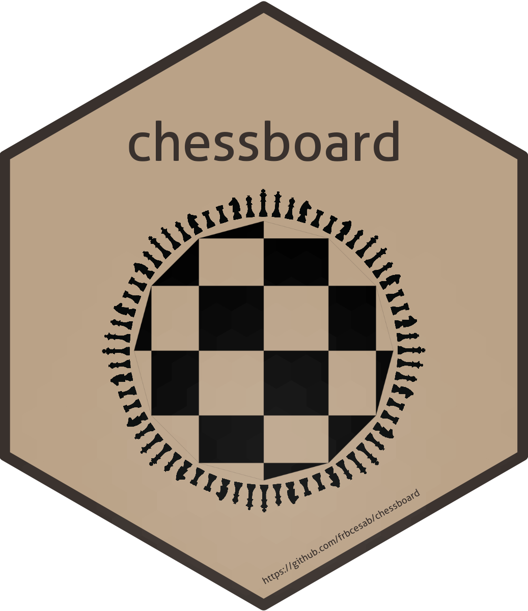

<!-- README.md is generated from README.Rmd. Please edit that file -->


```{r, include = FALSE}
knitr::opts_chunk$set(collapse  = TRUE,
                      comment   = "#>",
                      fig.path  = "man/figures/",
                      out.width = "100%")
```


chessboard 
=========================================================

<!-- badges: start -->
[](https://github.com/frbcesab/chessboard/actions/workflows/R-CMD-check.yaml)
[](https://app.codecov.io/gh/FRBCesab/chessboard)
[](https://github.com/frbcesab/chessboard/actions/workflows/pkgdown.yaml)
[](https://choosealicense.com/licenses/gpl-2.0/)
<!-- badges: end -->

## Table of contents

<p align="left">
  • <a href="#overview">Overview</a><br>
  • <a href="#features">Features</a><br>
  • <a href="#installation">Installation</a><br>
  • <a href="#get-started">Get started</a><br>
  • <a href="#long-form-documentations">Long-form documentations</a><br>
  • <a href="#citation">Citation</a><br>
  • <a href="#acknowledgments">Acknowledgments</a><br>
  • <a href="#code-of-conduct">Code of Conduct</a><br>
  • <a href="#references">References</a>
</p>

## Overview

The package `chessboard` provides functions to work with **directed**
(asymmetric) and **undirected** (symmetrical) spatial (or not) **networks**. It
implements different methods to detect neighbors, all based on the chess game
(it goes beyond the rook and the queen) to create complex connectivity scenarios.

`chessboard` can handle spatial networks, but it does not explicitly use geographical
coordinates to find neighbors (it is not based on spatial distance). 
Instead, it identifies neighbors according to **node labels**
(i.e. the node position on a two-dimension chessboard) and a specific method 
(pawn, fool, rook, bishop, knight, queen, wizard, etc.).

It implements the following rules to detect neighbors and create edges:

- the **degree** of neighborhood: the number of adjacent nodes that will be used
to create direct edges.

- the **orientation** of neighborhood: can neighbors be detected horizontally, 
vertically and/or diagonally?

- the **direction** of neighborhood: does the sampling has a main direction? 
This can be particularly relevant for directed networks (e.g. rivers).


## Features

The main purpose of `chessboard` is to create various network objects, including:

- **node list**
- **edge list**
- **connectivity matrix**

`chessboard` also provides different plotting functions (all based on the [`ggplot2`](https://ggplot2.tidyverse.org/) package):

- [`gg_matrix()`](https://frbcesab.github.io/chessboard/reference/gg_matrix.html)
plots a (connectivity) matrix
- [`gg_chessboard()`](https://frbcesab.github.io/chessboard/reference/gg_chessboard.html) 
plots the sampling as a chessboard

Read the [Visualization tools](https://frbcesab.github.io/chessboard/articles/visualization-tools.html) 
vignette for further details.


Finally, the package can also produce objects that will be used later in
Moran's Eigenvector Maps (MEM, Dray _et al._ 2006) and
Asymetric Eigenvector Maps (AEM, Blanchet _et al._ 2008), 
methods available in 
the package [`adespatial`](https://cran.r-project.org/package=adespatial) (Dray _et al._ 2022):

- **edges weights matrix**
- **spatial weights matrix**
- **nodes by edges matrix**
- **edges weights vector**


## Installation

The package is not yet published on the CRAN but you can install the development
version from GitHub with:

```{r eval=FALSE}
# install.packages("remotes")
remotes::install_github("frbcesab/chessboard")
```

Then you can attach the package `chessboard`:

```{r eval=FALSE}
library("chessboard")
```


## Get started

For an overview of the main features of `chessboard`, please read the 
[Get started](https://frbcesab.github.io/chessboard/articles/chessboard.html)
vignette.


## Long-form documentations

`chessboard` provides three vignettes to learn more about the package:

- the [Get started](https://frbcesab.github.io/chessboard/articles/chessboard.html)
vignette describes the core features of the package
- the [Chess pieces](https://frbcesab.github.io/chessboard/articles/chess-pieces.html)
vignette details the different methods implemented in `chessboard` to detect
neighbors
- the [Visualization tools](https://frbcesab.github.io/chessboard/articles/visualization-tools.html)
vignette describes the plotting functions available in `chessboard`


## Citation

A companion paper has been submitted to [Journal of Open Source Software](https://joss.theoj.org/).
In the meantime, if you want to use the package, please cite it as: 

> Casajus N (`r format(Sys.Date(), "%Y")`) chessboard: An R 
package for neighborhood and connectivity in spatial networks. 
R package version 0.1.


## Acknowledgments

This package has been developed for the 
[FRB-CESAB](https://www.fondationbiodiversite.fr/en/about-the-foundation/le-cesab/) 
working group 
[Bridge](https://www.fondationbiodiversite.fr/en/the-frb-in-action/programs-and-projects/le-cesab/bridge/) 
that aims to better understand the role of local and regional environmental 
factors in shaping the taxonomic and functional diversity of plant communities 
established along river corridors, roadside corridors and cultivated field 
margins.


## Code of Conduct

Please note that the `chessboard` project is released with a 
[Contributor Code of Conduct](https://contributor-covenant.org/version/2/1/CODE_OF_CONDUCT.html). 
By contributing to this project, you agree to abide by its terms.


## References

Blanchet FG, Legendre P & Borcard D (2008) Modelling directional spatial processes 
in ecological data. **Ecological Modelling**, 215, 325-336. 
doi: [10.1016/j.ecolmodel.2008.04.001](https://doi.org/10.1016/j.ecolmodel.2008.04.001).

Csardi G & Nepusz T (2006) The igraph software package for complex network research. 
**InterJournal, Complex Systems**, 1695, 1-9. <https://igraph.org/>.

Dray S, Bauman D, Blanchet G _et al._ (2022) `adespatial`: Multivariate Multiscale Spatial Analysis. 
R package version 0.3-16, <https://CRAN.R-project.org/package=adespatial>.

Dray S, Legendre P & Peres-Neto PR (2006) Spatial modeling: a comprehensive 
framework for principal coordinate analysis of neighbor matrices (PCNM). 
**Ecological Modelling**, 196: 483–93. 
doi: [10.1016/j.ecolmodel.2006.02.015](https://doi.org/10.1016/j.ecolmodel.2006.02.015).

