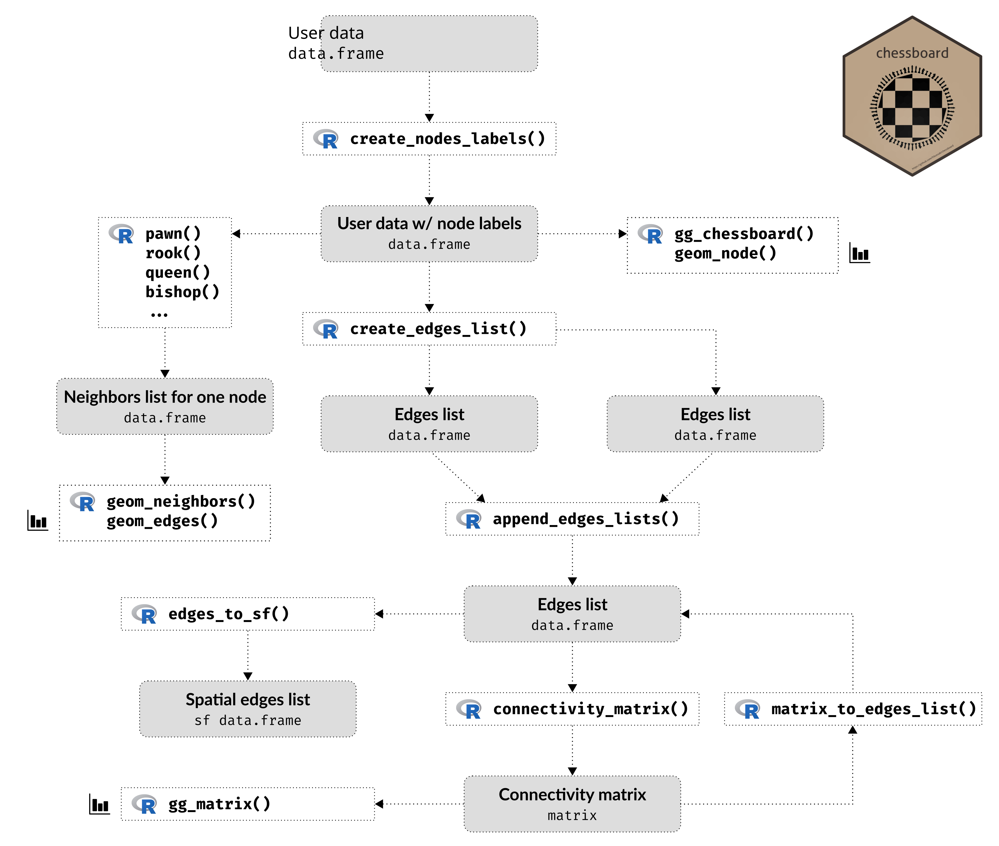
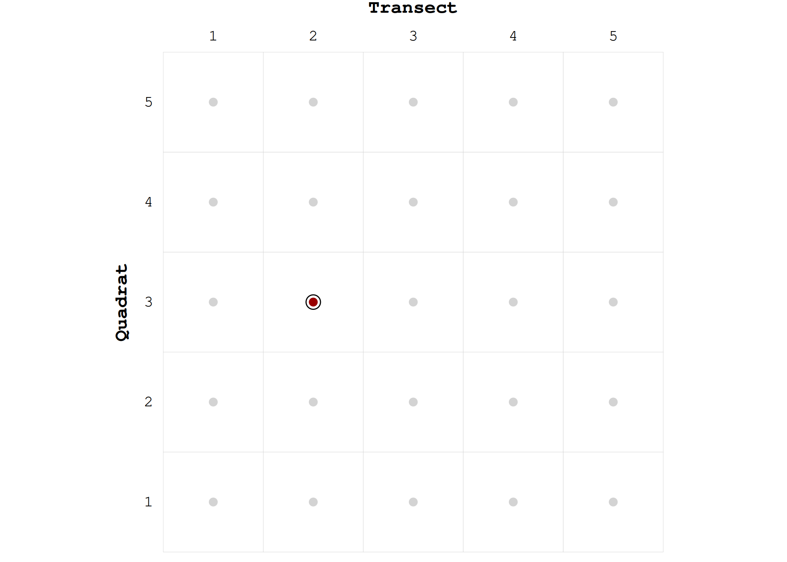
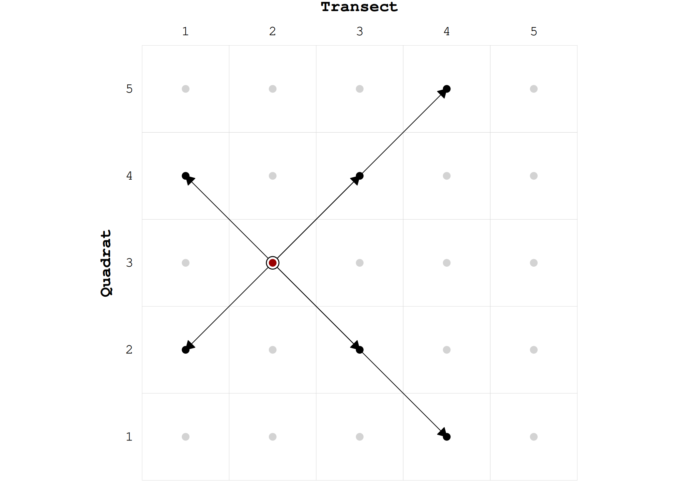
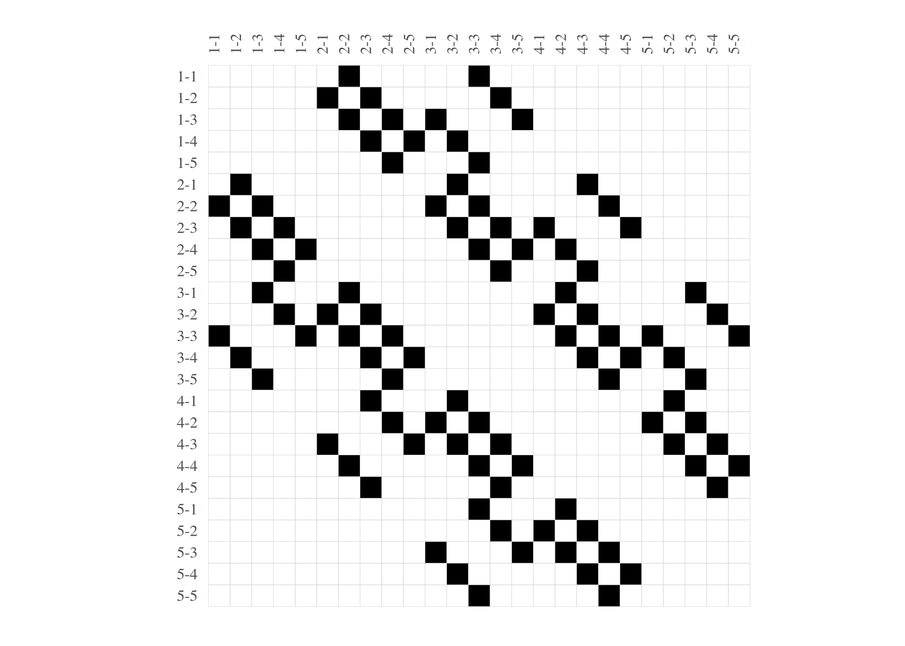

<!-- README.md is generated from README.Rmd. Please edit that file -->

# chessboard 

<!-- badges: start -->

[](https://github.com/frbcesab/chessboard/actions/workflows/R-CMD-check.yaml)
[](https://app.codecov.io/gh/FRBCesab/chessboard)
[](https://github.com/frbcesab/chessboard/actions/workflows/pkgdown.yaml)
[](https://choosealicense.com/licenses/gpl-2.0/)
<!-- badges: end -->

## Overview

The package `chessboard` provides functions to work with **directed**
(asymmetric) and **undirected** (symmetrical) spatial (or not)
**networks**. It implements different methods to detect neighbors, all
based on the chess game (it goes beyond the rook and the queen) to
create complex connectivity scenarios.

`chessboard` can handle spatial networks, but it does not explicitly use
geographical coordinates to find neighbors (it is not based on spatial
distance). Instead, it identifies neighbors according to the **node
labels** (i.e. the node positions on a two-dimension chessboard) and a
specific method (pawn, fool, rook, bishop, knight, queen, wizard, etc.).

It implements the following rules to detect neighbors and create edges:

- the **degree** of neighborhood: the number of adjacent nodes that will
  be used to create direct edges.

- the **orientation** of neighborhood: can neighbors be detected
  horizontally, vertically and/or diagonally?

- the **direction** of neighborhood: does the sampling has a main
  direction? This can be particularly relevant for directed networks
  (e.g. rivers).

## Features

The main purpose of `chessboard` is to create various network objects,
including:

- the **nodes list**
- the **edges list**
- the **connectivity matrix**

`chessboard` also provides different plotting functions (all based on
the [`ggplot2`](https://ggplot2.tidyverse.org/) package):

- [`gg_matrix()`](https://frbcesab.github.io/chessboard/reference/gg_matrix.html)
  plots a (connectivity) matrix
- [`gg_chessboard()`](https://frbcesab.github.io/chessboard/reference/gg_chessboard.html)
  plots the sampling as a chessboard

Read the [Visualization
tools](https://frbcesab.github.io/chessboard/articles/visualization-tools.html)
vignette for further details.



Finally, the package can also produce objects that can be used later in
Moran’s Eigenvector Maps (MEM, Dray *et al.* 2006) and Asymetric
Eigenvector Maps (AEM, Blanchet *et al.* 2008), methods available in the
package [`adespatial`](https://cran.r-project.org/package=adespatial)
(Dray *et al.* 2022):

- the **edges weights matrix**
- the **spatial weights matrix**
- the **nodes by edges matrix**
- the **edges weights vector**

## Installation

The package is not yet published on the CRAN but you can install the
development version from GitHub with:

``` r
# install.packages("remotes")
remotes::install_github("frbcesab/chessboard")
```

Then you can attach the package `chessboard`:

``` r
library("chessboard")
```

## Get started

This section is an overview of the main features of `chessboard`. For a
longer description, please read the [Get
started](https://frbcesab.github.io/chessboard/articles/chessboard.html)
vignette.

To illustrate `chessboard`, let’s create a fictitious sampling of
dimensions 5 transects x 5 quadrats.

``` r
# Fictitious sampling (non spatial) ----
sampling <- expand.grid("transect" = 1:5, 
                        "quadrat"  = 1:5)

head(sampling, 12)
#>    transect quadrat
#> 1         1       1
#> 2         2       1
#> 3         3       1
#> 4         4       1
#> 5         5       1
#> 6         1       2
#> 7         2       2
#> 8         3       2
#> 9         4       2
#> 10        5       2
#> 11        1       3
#> 12        2       3
```

Now let’s create labels for the 25 nodes.

``` r
# Create nodes labels ----
nodes <- create_nodes_labels(data     = sampling,
                             transect = "transect",
                             quadrat  = "quadrat")

head(nodes, 12)
#>    node location transect quadrat
#> 1   1-1        1        1       1
#> 2   1-2        1        1       2
#> 3   1-3        1        1       3
#> 4   1-4        1        1       4
#> 5   1-5        1        1       5
#> 6   2-1        1        2       1
#> 7   2-2        1        2       2
#> 8   2-3        1        2       3
#> 9   2-4        1        2       4
#> 10  2-5        1        2       5
#> 11  3-1        1        3       1
#> 12  3-2        1        3       2
```

The node labels are a combination of the transect identifier (i.e. the
position of the node on the x-axis of the chessboard) and the quadrat
(i.e. the position of the node on the y-axis of the chessboard). The
following figure locates the node `2-3` on the chessboard.

**N.B.** `chessboard` can handle multi-sites sampling. The function
`create_nodes_labels()` will always return a column `location` even if
the sampling is on one single site.

``` r
# Visualize the sampling as a chessboard ----
gg_chessboard(nodes) +
  geom_piece(nodes, focus = "2-3")
```



Now it’s time to implement a connectivity scenario. Let’s say we want to
connect nodes according to the
[bishop](https://en.wikipedia.org/wiki/Bishop_(chess)) move, with a
degree of neighborhood of 2. Our network will be undirected.

First, let’s use the function
[`bishop()`](https://frbcesab.github.io/chessboard/reference/bishop.html)
to understand the move.

``` r
# Find neighbors according to the bishop move (for one node) ----
nb <- bishop(nodes    = nodes, 
             focus    = "2-3", 
             degree   = 2, 
             directed = FALSE)

nb
#>   node location transect quadrat
#> 1  1-2        1        1       2
#> 2  1-4        1        1       4
#> 3  3-2        1        3       2
#> 4  3-4        1        3       4
#> 5  4-1        1        4       1
#> 6  4-5        1        4       5
```

The function
[`bishop()`](https://frbcesab.github.io/chessboard/reference/bishop.html)
(and all other functions named after the chess game) returns a subset of
the `nodes` object containing the neighbors of the `focus` node (here
`2-3`).

Let’s use some plotting functions of `chessboard` to inspect the
results:

``` r
gg_chessboard(nodes) +
  geom_edges(nodes, "2-3", nb) +
  geom_neighbors(nodes, nb) +
  geom_piece(nodes, "2-3")
```



The [Chess
pieces](https://frbcesab.github.io/chessboard/articles/chess-pieces.html)
vignette details all possible moves implemented in `chessboard` and the
effects of the arguments `degree`, `directed`, `reverse` and `self`.

Now we can detect the neighbors for the 25 nodes using the function
[`create_edges_list()`](https://frbcesab.github.io/chessboard/reference/create_edges_list.html).

``` r
# Create edges according to the bishop move (for all nodes) ----
edges <- create_edges_list(nodes    = nodes,
                           method   = "bishop",
                           degree   = 2, 
                           directed = FALSE)

head(edges)
#>   from  to
#> 1  1-1 2-2
#> 2  1-1 3-3
#> 3  1-2 2-1
#> 4  1-2 2-3
#> 5  1-2 3-4
#> 6  1-3 2-2
```

This function returns an edges list, i.e. a two-column `data.frame`
where a row corresponds to an edge.

Let’s compute the connectivity matrix of this undirected network.

``` r
mat <- connectivity_matrix(edges)

dim(mat)
#> [1] 25 25
```

Finally, let’s plot this matrix with the function
[`gg_matrix()`](https://frbcesab.github.io/chessboard/reference/gg_matrix.html).

``` r
gg_matrix(mat)
```



These networks objects can then be used with the R packages
[`adespatial`](https://CRAN.R-project.org/package=adespatial) (Dray *et
al.* 2022) and [`igraph`](https://cran.r-project.org/package=igraph)
(Csardi & Nepusz 2006).

## Long-form documentations

`chessboard` provides four vignettes to learn more about the package:

- the [Get
  started](https://frbcesab.github.io/chessboard/articles/chessboard.html)
  vignette describes the core features of the package
- the [Chess
  pieces](https://frbcesab.github.io/chessboard/articles/chess-pieces.html)
  vignette details the different methods implemented in `chessboard` to
  detect neighbors
- the [Visualization
  tools](https://frbcesab.github.io/chessboard/articles/visualization-tools.html)
  vignette describes the plotting functions available in `chessboard`
- the [Case
  study](https://frbcesab.github.io/chessboard/articles/case-study.html)
  vignette illustrates the use of the package on a sampling along the
  French river *L’Adour* (directed spatial network)

## Citation

A companion paper will be published soon. In the meantime, if you want
to use the package, please use the following citation:

> Casajus N (2023) chessboard: An R package for neighborhood and
> connectivity in spatial networks. R package version 0.1.

## Acknowledgments

This package has been developed for the
[FRB-CESAB](https://www.fondationbiodiversite.fr/en/about-the-foundation/le-cesab/)
working group
[Bridge](https://www.fondationbiodiversite.fr/en/the-frb-in-action/programs-and-projects/le-cesab/bridge/)
that aims to better understand the role of local and regional
environmental factors in shaping the taxonomic and functional diversity
of plant communities established along river corridors, roadside
corridors and cultivated field margins.

## Code of Conduct

Please note that the `chessboard` project is released with a
[Contributor Code of
Conduct](https://contributor-covenant.org/version/2/1/CODE_OF_CONDUCT.html).
By contributing to this project, you agree to abide by its terms.

## References

Blanchet FG, Legendre P & Borcard D (2008) Modelling directional spatial
processes in ecological data. **Ecological Modelling**, 215, 325-336.
doi:
[10.1016/j.ecolmodel.2008.04.001](https://doi.org/10.1016/j.ecolmodel.2008.04.001).

Csardi G & Nepusz T (2006) The igraph software package for complex
network research. **InterJournal, Complex Systems**, 1695, 1-9.
<https://igraph.org/>.

Dray S, Bauman D, Blanchet G *et al.* (2022) `adespatial`: Multivariate
Multiscale Spatial Analysis. R package version 0.3-16,
<https://CRAN.R-project.org/package=adespatial>.

Dray S, Legendre P & Peres-Neto PR (2006) Spatial modeling: a
comprehensive framework for principal coordinate analysis of neighbor
matrices (PCNM). **Ecological Modelling**, 196: 483–93. doi:
[10.1016/j.ecolmodel.2006.02.015](https://doi.org/10.1016/j.ecolmodel.2006.02.015).
