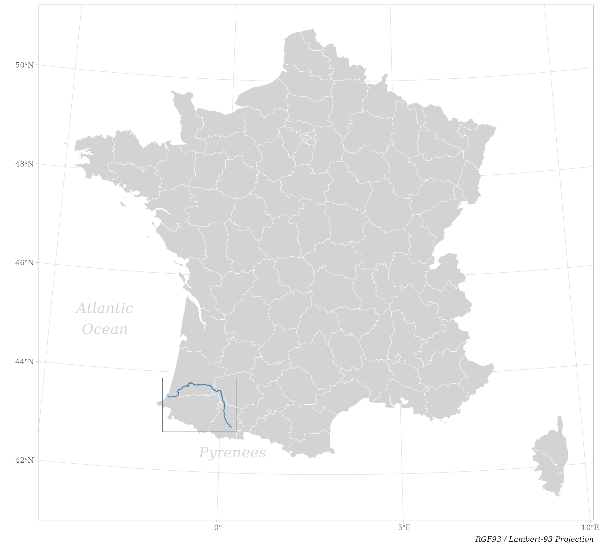

```{r include=FALSE}
knitr::opts_chunk$set(collapse  = TRUE,
                      comment   = "#>",
                      out.width = "50%",
                      dpi       = 96,
                      fig.align = "center")
```


To illustrate the main features of the package `chessboard`, let's take a real-world 
example: a survey sampling along the French river _L'Adour_ (Fig. 1).


```{r 'map-adour-river', echo=FALSE, fig.height=9, fig.width=10, out.width='80%', fig.cap='Figure 1. Location of the French river L\'Adour'}

```


_L'Adour_ is a river in southwestern France. It rises in the Pyrenees and 
flows into the Atlantic Ocean (Bay of Biscay). It's oriented from south-east 
(upstream) to north-west (downstream).


```{r setup}
# Setup ----
library("chessboard")
library("ggplot2")
```


```{r 'ggplot-theme', echo=FALSE}
## Custom ggplot2 theme ----
custom_theme <- function() {
  theme_light() + 
  theme(plot.title   = element_text(face = "bold", family = "serif", size = 18),
        plot.caption = element_text(face = "italic", family = "serif"),
        axis.title   = element_blank(),
        axis.text    = element_text(family = "serif"))
}
```


## Data

Along this river, a survey has been realized at **three** locations (Fig. 2).
At each location, a sampling has been conducted on a regular grid composed of 
**three** transects each of them composed of **five** quadrats.


\

```{r 'import-adour-river', echo=FALSE}
## Import the spatial layer of Adour river ----
path_to_file <- system.file("extdata", "adour_lambert93.gpkg", 
                            package = "chessboard")
adour_river  <- sf::st_read(path_to_file, quiet = TRUE)
```

```{r 'import-adour-sites', echo=FALSE}
## Import sites data ----
path_to_file <- system.file("extdata", "adour_survey_sampling.csv", 
                            package = "chessboard")
adour_sites  <- read.csv(path_to_file)

## Convert data.frame to sf object ----
adour_sites_sf <- sf::st_as_sf(adour_sites, coords = c("longitude", "latitude"),
                               crs = "epsg:2154")
```


```{r 'map-adour-sites', fig.height=9, fig.width=12, out.width='80%', echo=FALSE, fig.cap='Figure 2. Study area with survey sampling'}
ggplot() +
  geom_sf(data = adour_river, col = "steelblue") +
  geom_sf(data = adour_sites_sf, shape = 19, size = 2) +
  labs(caption = "RGF93 / Lambert-93 Projection") +
  custom_theme() +
  geom_segment(aes(x = 454180, xend = 440170, y = 6216290, yend = 6263320), 
               arrow = arrow(length = unit(0.75, 'cm'), type = 'closed'),
               linewidth = 2.25) +
  geom_text(aes(x = 334500, y = 6285000), label = "River", hjust = 0,
            color = "steelblue", fontface = "bold", size = 6, 
            family = "serif") +
  geom_text(aes(x = 414950, y = 6312200), label = "Location 3", hjust = -0.20,
            color = "black", fontface = "bold", size = 6, family = "serif") +
  geom_text(aes(x = 474655, y = 6236708), label = "Location 1", 
            color = "black", fontface = "bold", size = 6, family = "serif") +
  geom_text(aes(x = 467250, y = 6287620), label = "Location 2", 
            color = "black", fontface = "bold", size = 6, family = "serif")
```


\


The arrow indicates the direction of the river flow. This means that our 
sampling design is a **directed spatial network** (both inside a location and
between locations) where the main direction is from upstream to downstream. 

\

Let's import this dataset provided by `chessboard`.


```{r 'import-data', echo=TRUE}
# Import data ----
path_to_file <- system.file("extdata", "adour_survey_sampling.csv", 
                            package = "chessboard")

sampling  <- read.csv(path_to_file)

dim(sampling)

head(sampling)

tail(sampling)
```

This `data.frame` contains the following columns: 

- `location`: the identifier of the location (`numeric`)
- `transect`: the identifier of the transect (`numeric`)
- `quadrat`: the identifier of the quadrat (`numeric`)
- `longitude`: the longitude of the site (**node**) defined in the [RGF93 / Lambert-93](https://epsg.io/2154) projection
- `latitude`: the latitude of the site (**node**) defined in the [RGF93 / Lambert-93](https://epsg.io/2154) projection

\


**N.B.** The column `location` is optional (if the survey has been conducted at one single location).
If the network has one dimension, one of the columns `transect` and `quadrat` can
be omitted.


## Creating nodes labels

When working with `chessboard`, the first step is to create nodes
labels with the function `create_nodes_labels()`.


```{r 'create-nodes-labels'}
# Create nodes labels ----
nodes <- create_nodes_labels(data     = sampling,
                             location = "location",
                             transect = "transect",
                             quadrat  = "quadrat")

head(nodes, 12)
```


The nodes labels are a combination of the transect and the quadrat identifiers.

We can visualize this sampling on a Cartesian referential, i.e. non-spatial, where
the x-axis corresponds to **transects** and the y-axis represents the **quadrats**
(Fig. 3). This new referential is called a chessboard.


\


```{r 'plot-sampling-units', fig.height=10, fig.width=3, echo=FALSE, out.width='50%', fig.cap='Figure 3. Sampling design'}
gg_chessboard(nodes)
```


