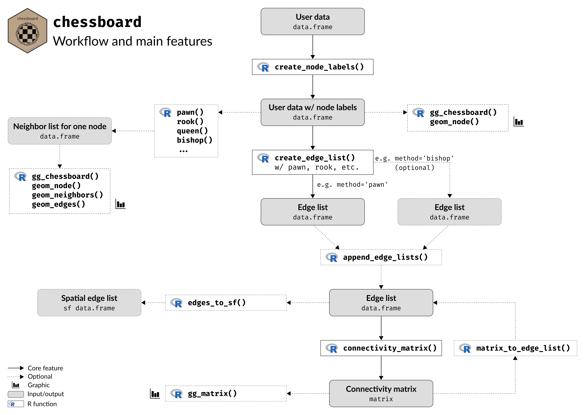

```{r include=FALSE}
knitr::opts_chunk$set(collapse  = TRUE,
                      comment   = "#>",
                      out.width = "100%",
                      dpi       = 96,
                      fig.align = "center")
```


The aim of the package `chessboard` is to provide tools to work with **directed**
(asymmetric) and **undirected** (symmetrical) spatial (or non-spatial) **networks**. 
It implements different methods to detect neighbors, all based on the chess game
(it goes beyond the rook and the queen available in many R packages) to create 
complex connectivity scenarios.


`chessboard` aims to easily create various network objects, including:

- **node list**, i.e. a list of all nodes of the network;
- **edge list**, i.e. a list of all edges (links) between pairs of nodes;
- **connectivity matrix**, i.e. a binary matrix of dimensions `n x n`, where 
`n` is the number of **nodes** (sampling units) indicating the presence (`1`) 
or the absence (`0`) of an **edge** (link) between pairs of nodes.


```{r 'setup', echo=TRUE}
# Setup ----
library("chessboard")
library("ggplot2")
library("patchwork")
```


```{r 'ggplot-theme', echo=FALSE}
## Custom ggplot2 theme ----
custom_theme <- function() {
  theme_light() + 
  theme(plot.title   = element_text(face = "bold", family = "serif", size = 18),
        plot.caption = element_text(face = "italic", family = "serif"),
        axis.title   = element_blank(),
        axis.text    = element_text(family = "serif"))
}
```

\

## Network properties

`chessboard` can handle spatial networks, but it does not explicitly use geographical
coordinates to find neighbors (it is not based on spatial distance). 
Instead, it identifies neighbors according to **node labels**
(i.e. the node position on a two-dimension chessboard) and a specific method 
(pawn, fool, rook, bishop, knight, queen, wizard, etc.) derived from the chess game.

\

```{r 'cb-network', eval=TRUE, fig.height=8, fig.width=5, echo=FALSE, fig.cap="Figure 1. Network as a chessboard", out.width='60%'}
sites <- expand.grid("transect" = 1:3, "quadrat" = 1:5)

nodes <- create_node_labels(data     = sites,
                            transect = "transect", 
                            quadrat  = "quadrat")

gg_chessboard(nodes)
```

\

The package `chessboard` is designed to work with two-dimensional networks (i.e. 
sampling on a regular grid), where one dimension is called **transect** 
and the other is called **quadrat**. By convention, the dimension **transect** 
corresponds to the x-axis, and the **quadrat** corresponds to the y-axis (Fig. 1). 

`chessboard` can also deal with one-dimensional network 
(either **transect-only** or **quadrat-only**).


The network can be undirected or directed. If the network is **directed**, it will 
have (by default) these two orientations:

- from bottom to top (along transect) for quadrats
- from left to right (along quadrat) for transects


\

## Neighbors detection


`chessboard` implements the following rules to detect neighbors and to create edges:

- the **degree** of neighborhood: the number of adjacent nodes that will be used
to create direct edges.

- the **orientation** of neighborhood: can neighbors be detected horizontally, 
vertically and/or diagonally?

- the **direction** of neighborhood: does the sampling has a main direction? 
This can be particularly relevant for directed networks (e.g. rivers).


\

## Workflow

The Figure 2 shows the general workflow and the main features of `chessboard`.

\

```{r echo = FALSE, out.width = "100%", fig.cap = "Figure 2. Workflow and main features of `chessboard`", fig.align = 'center'}

```

\

### Data

The package `chessboard` comes with a real-world example: a survey sampling 
along the French river _L'Adour_ (Fig. 3). _L'Adour_ is a river in southwestern 
France. It rises in the Pyrenees and flows into the Atlantic Ocean (Bay of Biscay). 
It's oriented from south-east (upstream) to north-west (downstream).

\

```{r 'map-adour-river', echo=FALSE, fig.height=9, fig.width=10, out.width='80%', fig.cap='Figure 3. Location of the French river L\'Adour'}
knitr::include_graphics("figures/map-adour-river.png")
```

\


Along this river, a survey has been realized at **three** locations (Fig. 4).
At each location, a sampling has been conducted on a regular grid composed of 
**three** transects each of them composed of **five** quadrats.

\

```{r 'import-adour-river', echo=FALSE}
## Import the spatial layer of Adour river ----
path_to_file <- system.file("extdata", "adour_lambert93.gpkg", 
                            package = "chessboard")
adour_river  <- sf::st_read(path_to_file, quiet = TRUE)
```

```{r 'import-adour-sites', echo=FALSE}
## Import sites data ----
path_to_file <- system.file("extdata", "adour_survey_sampling.csv", 
                            package = "chessboard")
nodes  <- read.csv(path_to_file)

## Convert data.frame to sf object ----
nodes_sf <- sf::st_as_sf(nodes, coords = c("longitude", "latitude"),
                               crs = "epsg:2154")
```


```{r 'map-adour-sites', fig.height=9, fig.width=12, out.width='80%', echo=FALSE, fig.cap='Figure 4. Survey sampling along the river L\'Adour'}
ggplot() +
  geom_sf(data = adour_river, col = "steelblue") +
  geom_sf(data = nodes_sf, shape = 19, size = 2) +
  labs(caption = "RGF93 / Lambert-93 Projection") +
  custom_theme() +
  geom_segment(aes(x = 454180, xend = 440170, y = 6216290, yend = 6263320), 
               arrow = arrow(length = unit(0.75, 'cm'), type = 'closed'),
               linewidth = 2.25) +
  geom_text(aes(x = 334500, y = 6285000), label = "River", hjust = 0,
            color = "steelblue", fontface = "bold", size = 6, 
            family = "serif") +
  geom_text(aes(x = 414950, y = 6312200), label = "Location 3", hjust = -0.20,
            color = "black", fontface = "bold", size = 6, family = "serif") +
  geom_text(aes(x = 474655, y = 6236708), label = "Location 1", 
            color = "black", fontface = "bold", size = 6, family = "serif") +
  geom_text(aes(x = 467250, y = 6287620), label = "Location 2", 
            color = "black", fontface = "bold", size = 6, family = "serif")
```


The arrow in Fig. 4 indicates the direction of the river flow. This means that our 
sampling design is a **directed spatial network** (both inside a location and
between locations) where the main direction is from upstream to downstream. 

\

Let's import this dataset provided by `chessboard`.


```{r 'import-data', echo=TRUE}
# Import data ----
path_to_file <- system.file("extdata", "adour_survey_sampling.csv", 
                            package = "chessboard")

sampling  <- read.csv(path_to_file)

dim(sampling)
```

```{r 'head-of-data', echo=TRUE}
# First rows ----
head(sampling, 10)
```

```{r 'tail-of-data', echo=TRUE}
# Last rows ----
tail(sampling, 10)
```

This `data.frame` contains the following columns: 

- `location`: the identifier of the location (`numeric`)
- `transect`: the identifier of the transect (`numeric`)
- `quadrat`: the identifier of the quadrat (`numeric`)
- `longitude`: the longitude of the site (**node**) defined in the [RGF93 / Lambert-93](https://epsg.io/2154) projection
- `latitude`: the latitude of the site (**node**) defined in the [RGF93 / Lambert-93](https://epsg.io/2154) projection


**N.B.** The column `location` is optional if the survey has been conducted at one single location.
If the network has one dimension, one of the columns `transect` and `quadrat` can
be omitted. If the survey is not spatial, the columns `longitude` and `latitude` can be omitted.


\


### Node labels

When working with `chessboard`, the **first step** is to create node
labels with the function `create_node_labels()`.

\

But first, let's reduce the size of data by selecting the first location.


```{r 'select-data'}
# Select the first location ----
sampling <- sampling[sampling$"location" == 1, ]

dim(sampling)
```

\

Let's create node labels with the function `create_node_labels()`.

```{r 'create-nodes-labels'}
# Create node labels ----
nodes <- create_node_labels(data     = sampling,
                            location = "location",
                            transect = "transect",
                            quadrat  = "quadrat")

nodes
```


Node labels are a combination of the transect and the quadrat identifiers. They must be **unique**.

\

We can visualize this sampling on a Cartesian referential, i.e. non-spatial, where
the x-axis corresponds to **transects** and the y-axis represents the **quadrats**
(Fig. 5). This new referential is called a chessboard.


```{r 'plot-sampling-units', fig.height=8, fig.width=5, echo=TRUE, out.width='60%', fig.cap='Figure 5. Sampling survey as a chessboard'}
# Visualize chessboard ----
gg_chessboard(nodes)
```


\

The function `get_node_list()` can be used to extract and order the node list.

```{r 'get-node-labels'}
# Extract node labels ----
get_node_list(nodes)
```

\


### Edge list

The creation of a list of edges (links) between nodes (sampling units) is based 
on the detection of neighbors.

In `chessboard` different methods have been implemented to define neighborhood (argument `method` 
of the function `create_edge_list()`). These methods
are named `'pawn'`, `'rook'`, `'bishop'`, `'queen'`, etc. A complete list of
available methods is available at: 
[https://frbcesab.github.io/chessboard/reference/index.html#detect-neighbors](https://frbcesab.github.io/chessboard/reference/index.html#detect-neighbors)


\


Before using the function `create_edge_list()`, users can explore these different
methods by calling the functions `pawn()`, `rook()`, `bishop()`, `queen()`, etc.
These functions only work on a specific node (argument `focus`).

\

Let's take a look of the neighborhood method `pawn()`.

```{r 'method-pawn'}
# Explore pawn method to find neighbors ----
neighbors_pawn <- pawn(nodes    = nodes, 
                       focus    = "2-3", 
                       degree   = 1, 
                       directed = FALSE, 
                       reverse  = FALSE)
neighbors_pawn
```


\


The package `chessboard` contains functions to visualize detected neighbors on a
chessboard: `gg_chessboard()` is used to plot a chessboard (dimensions defined by the
node list), `geom_node()` emphasizes the focus node (in red), and `geom_neighbors()` adds
the detected neighbors (dots in black).

\

```{r 'nb-pawn', fig.height=8, fig.width=5, echo=TRUE, fig.cap="Figure 6. Detected neighbors (pawn method)", out.width='50%'}
gg_chessboard(nodes) +
  geom_node(nodes, focus = "2-3") +
  geom_neighbors(nodes, neighbors_pawn)
```


\

The function `pawn()` can detect neighbors vertically, i.e. among 
quadrats along a transect. User can change the default settings 
by increasing the degree of neighborhood (`degree = 4`, Fig. 7A),
by adding directionality (`directed = TRUE`, Fig. 7B), and 
by reversing the default directionality (`directed = TRUE` and `reverse = TRUE`, Fig. 7C).


```{r 'cb-pawn', fig.height=4.3, fig.width=12, echo=FALSE, fig.cap="Figure 7. Pawn movements", out.width='100%'}
demo_sites <- expand.grid("transect" = 1:9, "quadrat" = 1:9)

demo_nodes <- create_node_labels(data     = demo_sites,
                                 transect = "transect", 
                                 quadrat  = "quadrat")

demo_focus  <- "5-5"

pawn_1 <- 
  gg_chessboard(demo_nodes, "A. Undirected network", "") + 
  geom_node(demo_nodes, demo_focus) +
  geom_neighbors(demo_nodes, pawn(demo_nodes, demo_focus, degree = 4, 
                                  directed = FALSE, reverse = FALSE))

pawn_2 <- 
  gg_chessboard(demo_nodes, "B. Directed network", "") + 
  geom_node(demo_nodes, demo_focus) +
  geom_neighbors(demo_nodes, pawn(demo_nodes, demo_focus, degree = 4, 
                                  directed = TRUE, reverse = FALSE))

pawn_3 <- 
  gg_chessboard(demo_nodes, "C. Directed network (reverse)", "") + 
  geom_node(demo_nodes, demo_focus) +
  geom_neighbors(demo_nodes, pawn(demo_nodes, demo_focus, degree = 4, 
                                  directed = TRUE, reverse = TRUE))

(pawn_1 | pawn_2 | pawn_3)
```


\


Let's take another example. 
The function `bishop()` can detect neighbors diagonally. 
User can change the default settings 
by increasing the degree of neighborhood (`degree = 4`, Fig. 8A),
by adding directionality (`directed = TRUE`, Fig. 8B), and 
by reversing the default directionality (`directed = TRUE` and `reverse = TRUE`, Fig. 8C).


```{r 'cb-bishop', eval=TRUE, fig.height=4.3, fig.width=12, echo=FALSE, fig.cap="Figure 8. Bishop movements", out.width='100%'}
demo_sites <- expand.grid("transect" = 1:9, "quadrat" = 1:9)

demo_nodes <- create_node_labels(data     = demo_sites,
                                 transect = "transect", 
                                 quadrat  = "quadrat")

demo_focus  <- "5-5"

bishop_1 <- 
  gg_chessboard(demo_nodes, "A. Undirected network", "") + 
  geom_node(demo_nodes, demo_focus) +
  geom_neighbors(demo_nodes, bishop(demo_nodes, demo_focus, degree = 4, 
                                    directed = FALSE, reverse = FALSE))

bishop_2 <- 
  gg_chessboard(demo_nodes, "B. Directed network", "") + 
  geom_node(demo_nodes, demo_focus) +
  geom_neighbors(demo_nodes, bishop(demo_nodes, demo_focus, degree = 4, 
                                    directed = TRUE, reverse = FALSE))

bishop_3 <- 
  gg_chessboard(demo_nodes, "C. Directed network (reverse)", "") + 
  geom_node(demo_nodes, demo_focus) +
  geom_neighbors(demo_nodes, bishop(demo_nodes, demo_focus, degree = 4, 
                                    directed = TRUE, reverse = TRUE))

(bishop_1 | bishop_2 | bishop_3)
```


\

The vignette [Chess pieces](https://frbcesab.github.io/chessboard/articles/chess-pieces.html) 
shows all possible methods available in `chessboard`.


\


Now, let's use the function `create_edge_list()` to create an edge list using the
method `'pawn'` with a degree `1` of neighborhood and in a directional way.


```{r 'create-edges-list-pawn'}
# Create edge list ----
edges_pawn <- create_edge_list(nodes    = nodes, 
                               method   = "pawn", 
                               degree   = 1, 
                               directed = TRUE,
                               reverse  = FALSE,
                               self     = FALSE)

edges_pawn
```


\


It's possible to visualize these edges on a map, i.e. by using spatial coordinates.
First, we need to convert our sites into a spatial object (`POINT`).

```{r 'df-to-sf'}
# Convert nodes to sf object ----
nodes_sf <- sf::st_as_sf(nodes, coords = c("longitude", "latitude"),
                               crs = "epsg:2154")

head(nodes_sf)
```


\


Now we can use the function `edges_to_sf()` to convert our edge list 
into a spatial object (`LINESTRING`).


```{r 'edges-list-to-sf'}
# Convert edge list to sf ----
edges_pawn_sf <- edges_to_sf(edges = edges_pawn, 
                             sites = nodes_sf)

edges_pawn_sf
```


\


We can now map our nodes and edges.

```{r 'map-edges-list-pawn', fig.height=8, fig.width=6.5, echo=TRUE, fig.cap="Figure 9. Edge list (pawn method)", out.width='80%'}
# Map of nodes and edges ----
ggplot(nodes_sf) +
  geom_sf(size = 12) +
  geom_sf(data = edges_pawn_sf) +
  theme_light()
```


\


Users may want to combine different methods to detect neighbors to build complex scenarios. It's possible
by using for each method the function `create_edge_list()` and using the
function `append_edge_lists()` to merge all edges in a single list.


```{r 'create-edges-list-bishop'}
# Create edge list (Bishop method) ----
edges_bishop <- create_edge_list(nodes    = nodes, 
                                 method   = "bishop", 
                                 degree   = 1, 
                                 directed = TRUE,
                                 reverse  = FALSE,
                                 self     = FALSE)

edges_bishop

# Merge Pawn and Bishop edges ----
edges <- append_edge_lists(edges_pawn, edges_bishop)

# Convert edges to spatial layer ----
edges_sf <- edges_to_sf(edges, nodes_sf)
```


\


```{r 'map-edges-list-pawn-bishop', fig.height=8, fig.width=6.5, echo=TRUE, fig.cap="Figure 10. Edges list (combined methods)", out.width='80%'}
# Map of nodes and edges ----
ggplot(nodes_sf) +
  geom_sf(size = 12) +
  geom_sf(data = edges_sf) +
  theme_light()
```


\


### Connectivity matrix


From this edge list, we can build a **connectivity matrix**, i.e. a binary 
matrix of dimensions `n x n`, where `n` is the number of nodes (sampling units) 
indicating the presence (`1`) or the absence (`0`) of an edge (link) between pairs 
of nodes.

\

We can use the function `connectivity_matrix()` of the package `chessboard`.

```{r 'connectivity-matrix'}
# Create connectivity matrix ----
conn_matrix <- connectivity_matrix(edges)

conn_matrix
```


\

The package `chessboard` provides a function to visualize this matrix:
`gg_matrix()`.

```{r 'plot-connectivity-matrix', fig.height=8, fig.width=8, fig.cap="Figure 11. Connectivity matrix", out.width='80%'}
# Visualize connectivity matrix ----
gg_matrix(conn_matrix)
```


\

Optionally, we can use the function `matrix_to_edge_list()` to convert back the
connectivity matrix to edge list.

```{r 'connectivity-matrix-to-df'}
# Convert connectivity matrix to edge list ----
matrix_to_edge_list(conn_matrix)
```


\


## Extending chessboard

`chessboard` has been built to be compatible with the following R packages: 
[`spdep`](https://r-spatial.github.io/spdep/) (Bivand & Wong 2018), 
[`igraph`](https://r.igraph.org/) (Csardi & Nepusz 2006), 
[`sf`](https://r-spatial.github.io/sf/) (Pebesma 2018), and 
[`ggplot2`](https://ggplot2.tidyverse.org) (Wickham 2016).


\


### with `sf`

As seen before, the edge list can be converted into an spatial object with the 
function `edges_to_sf()`. The output is an `sf` `LINESTRING` that can be handled
by many functions of the package `sf`. For instance, let's project the coordinate
system.

```{r 'transform-crs'}
# Convert edges to spatial layer ----
edges_sf <- edges_to_sf(edges, nodes_sf)

# Project the CRS ----
edges_sf_lonlat <- sf::st_transform(edges_sf, crs = "epsg:4326")

# Check ----
edges_sf
edges_sf_lonlat
```

User can also export this spatial layer.

```{r 'export-sf', eval=FALSE}
# Export layer as a GeoPackage ----
sf::st_write(edges_sf, "edge_list.gpkg")
```


For more information about the package `sf`, please visit the 
[manual](https://cran.r-project.org/web/packages/sf/sf.pdf).

\


### with `ggplot2`

All plotting functions in `chessboard` are produced with the `ggplot2` engine
and are highly customizable. For instance, let's change the default theme.


```{r 'change-theme', fig.height=8, fig.width=8, fig.cap="Figure 12. Custom connectivity matrix", out.width='80%'}
# Change default ggplot2 theme ----
gg_matrix(conn_matrix) +
  theme_bw() +
  theme(legend.position = "none")
```

For more information about the package `ggplot2`, please visit the 
[manual](https://cran.r-project.org/web/packages/ggplot2/ggplot2.pdf).


\


### with `igraph`

The package `igraph` is commonly use to analyze network data. User can use the 
function `igraph::graph_from_data_frame()` to convert the edge list created
with `chessboard` to an `igraph` object.

```{r 'to-igraph'}
# Convert edge list to igraph object ----
igraph_obj <- igraph::graph_from_data_frame(d        = edges, 
                                            directed = TRUE, 
                                            vertices = nodes)

# Check -----
class(igraph_obj)

print(igraph_obj)
```

Let's plot our network using `igraph`.

```{r 'plot-igraph', fig.height=8, fig.width=8, fig.cap="Figure 13. Network visualization w/ `igraph`", out.width='80%'}
# Plot the network w/ igraph ----
plot(igraph_obj)
```


For more information about the package `igraph`, please visit the 
[manual](https://cran.r-project.org/web/packages/igraph/igraph.pdf).


\


### with `spdep`

...


For more information about the package `spdep`, please visit the 
<!-- [manual](https://cran.r-project.org/web/packages/spdep/spdep.pdf). -->

\


## References

Bivand R & Wong D (2018) Comparing implementations of global and local 
indicators of spatial association. **TEST**, 27, 716–748.
<https://doi.org/10.1007/s11749-018-0599-x>.

Csardi G & Nepusz T (2006) The igraph software package for complex network 
research. **InterJournal, Complex Systems**, 1695, 1–9. <https://igraph.org/>.

Pebesma E (2018) Simple Features for R: Standardized support for spatial 
vector data. **The R Journal**, 10, 439–446. 
<https://doi.org/10.32614/RJ-2018-009>.

Wickham H (2016) _ggplot2: Elegant graphics for data analysis_ (p. 213). 
Springer-Verlag. 
<https://ggplot2.tidyverse.org/>.
