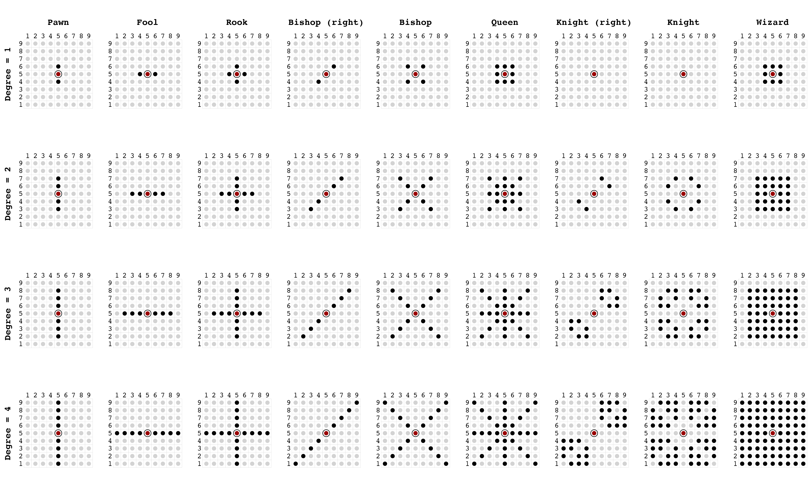
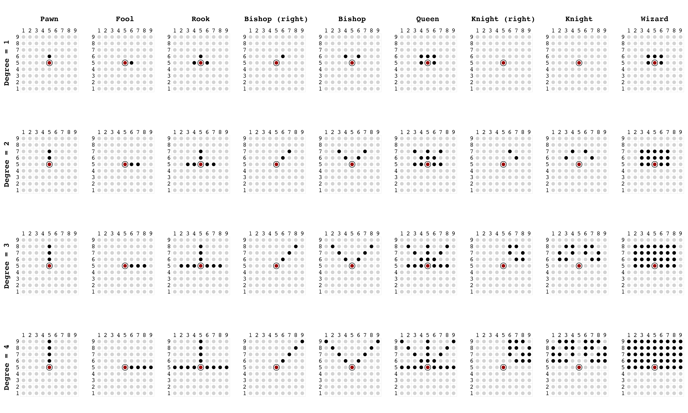
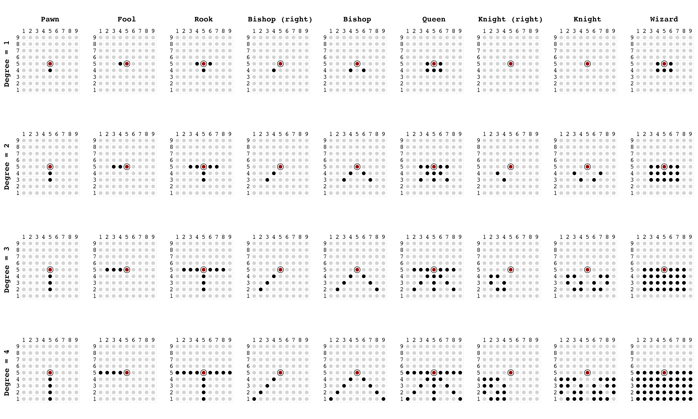

```{r include=FALSE}
knitr::opts_chunk$set(collapse  = TRUE,
                      comment   = "#>",
                      out.width = "100%",
                      dpi       = 150,
                      fig.align = "center")
```


## Undirected network

```{r 'img-1', echo=FALSE}

```


## Directed network

```{r 'img-2', echo=FALSE}

```


## Directed network (reverse)


```{r 'img-3', echo=FALSE}

```

